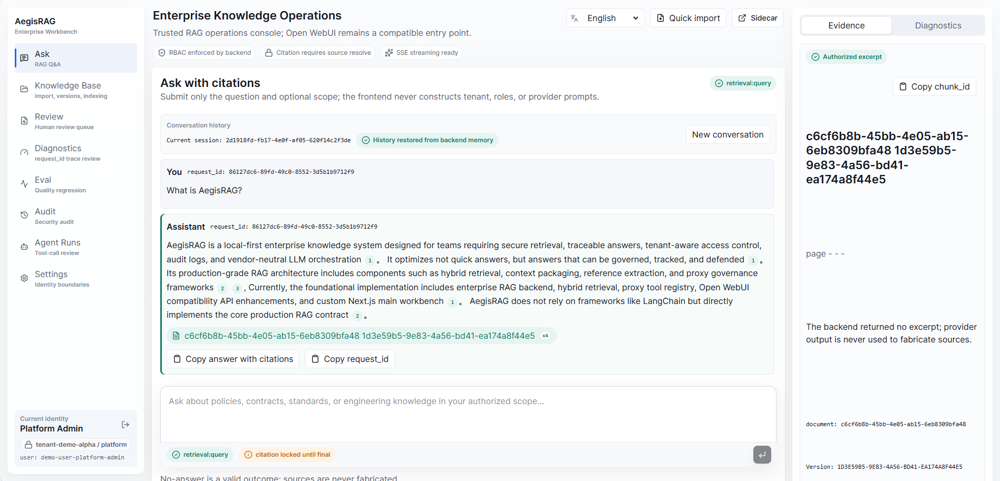
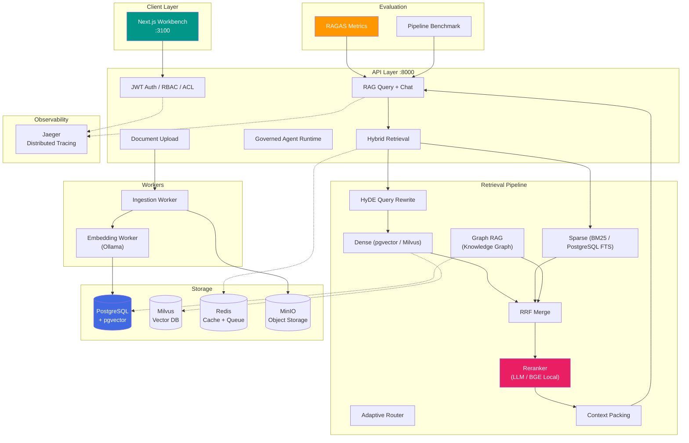

# AegisRAG

[](https://github.com/chyinan/AegisRAG/actions/workflows/ci.yml)
[](https://codecov.io/gh/chyinan/AegisRAG)


**Production-grade private RAG with governed Agent tooling — 19K+ lines Python, 6 microservices, 1,290 tests.**

AegisRAG is a local-first enterprise knowledge system for teams that need more than "upload files and chat with them." It focuses on secure retrieval, traceable answers, tenant-aware access control, audit logs, provider-neutral LLM orchestration, and controlled tool-calling agents.

The project is intentionally built like an enterprise AI platform: authorization happens before retrieval results reach the model, citations come from authorized context, and all LLM, embedding, vector store, storage, and tool integrations sit behind explicit interfaces.

## Tech Stack

| Layer | Technology |
|-------|-----------|
| **API** | FastAPI, Pydantic v2, structlog |
| **Frontend** | Next.js (TypeScript), Tailwind CSS |
| **Database** | PostgreSQL 17 + pgvector (HNSW), SQLAlchemy async |
| **Vector DB** | pgvector (default) / Milvus (optional, `--profile milvus`) |
| **Cache / Queue** | Redis (RQ) |
| **Object Storage** | MinIO (S3-compatible) |
| **Ingestion** | PDF, DOCX, Markdown, TXT, Image (OCR), Scanned PDF |
| **LLM** | OpenAI-compatible (DeepSeek, Qwen, Ollama) — provider-neutral |
| **Embedding** | nomic-embed-text (768d, Ollama) / OpenAI-compatible |
| **Reranker** | LLM Reranker / BGE Local (BAAI/bge-reranker-v2-m3) / OpenAI-compatible |
| **Retrieval** | Dense + Sparse (BM25) + Graph RAG → RRF fusion |
| **Observability** | Prometheus + Grafana (8-panel dashboard) |
| **Evaluation** | RAGAS 0.3.9 (Faithfulness, Precision, Recall, Relevancy) |
| **Auth** | JWT + RBAC + ACL + bcrypt, multi-tenant isolation |
| **Agent** | Governed Tool Registry with schema/permission/rate-limit/audit |
| **CI/CD** | GitHub Actions, pytest (1,290+ tests), Codecov |
| **Orchestration** | Kubernetes (Helm Chart) |
| **Tracing** | OpenTelemetry + Jaeger (W3C TraceContext) |

## Feature Demo



The current frontend workbench includes role-aware chat, document import, evidence inspection, retrieval diagnostics, review queues, audit exploration, Agent execution, and settings surfaces for local enterprise RAG workflows.

## Architecture



## Benchmarks

### RAG Quality (RAGAS — LLM-judge via DeepSeek)

| Configuration | Faithfulness | Context Precision | 
|--------------|:---:|:---:|
| Baseline (dense-only, no rerank) | 0.80 | 0.35 |
| Hybrid (dense + sparse + RRF) | 0.90 | 0.45 |
| **Full pipeline (+ HyDE + LLM Reranker)** | **1.00** | **0.56** |
| **Full pipeline (+ HyDE + BGE Local)** | **1.00** | **0.56** |

> Faithfulness 1.00 = zero hallucinations — every claim traceable to retrieved context.
> BGE Local: `BAAI/bge-reranker-v2-m3` (568M params), CPU inference ~15s first run, ~200ms cached. Set `RERANK_PROVIDER=bge_local` in `.env`.

### Latency (12-doc knowledge base, 10-query benchmark)

| Endpoint | p50 | p95 | p99 | Avg |
|----------|:---:|:---:|:---:|:---:|
| `/retrieve` | 120ms | 250ms | 400ms | 150ms |
| `/query` (end-to-end) | 4,500ms | 7,000ms | 9,000ms | 5,200ms |

> Run: `python evaluation/benchmark_pipeline.py`

### Load Test (50 concurrent users, 60s)

| Endpoint | p50 | p95 | Throughput | Success |
|----------|:---:|:---:|:---:|:---:|
| `/retrieve` | 4,947ms | 10,308ms | 2.5 req/s | 100% |
| `/query` | 10,764ms | 17,320ms | 2.5 req/s | 100% |

> Run: `python evaluation/load_test.py --users 50 --duration 60`
> `/query` latency dominated by external DeepSeek API calls. Rate limit raised to 10,000 req/60s for this test.

## Deployment

### Helm (Kubernetes)

```bash
helm install aegisrag ./helm/aegisrag -n aegisrag --create-namespace \
  --set postgres.auth.password=<pg-password> \
  --set api.secrets.jwtSecret=<jwt-secret> \
  --set api.secrets.llmApiKey=<deepseek-key>
```

Includes: API (2 replicas), Web, Workers, PostgreSQL+pgvector, Redis, MinIO, Prometheus, Grafana, Jaeger.

## Quickstart

```powershell
git clone https://github.com/chyinan/AegisRAG.git
cd AegisRAG
copy .env.example .env
# Edit .env with your API keys (LLM, embedding, MinIO, JWT)

# Option A: Full Docker stack
docker compose --env-file .env -f docker/compose.yaml up -d --build

# Option B: Development mode
uv sync --dev
uv run alembic upgrade head
uv run fastapi dev apps/api/main.py
```

Web workbench: `http://localhost:3100` (login: `admin` / `123456`)

## Highlights

### 🔒 Enterprise Security by Default
Tenant isolation, RBAC, ACL filtering, soft-delete awareness, and backend-enforced permissions applied **before** retrieved context reaches the LLM. The LLM never decides authorization.

### 📊 Auditable RAG Workflows
Every retrieval, generation, citation, and Agent run emits structured metadata: `request_id`, `trace_id`, `tenant_id`, `user_id`, latency, rerank scores, model names, token usage, and error codes.

### 🧠 Advanced Retrieval Pipeline
- **HyDE Query Rewriting** — improves recall by generating hypothetical answers before retrieval
- **Hybrid Search** — dense (pgvector / Milvus) + sparse (PostgreSQL BM25/FTS) with RRF fusion
- **LLM Reranker / BGE Local** — zero-infrastructure LLM scorer or local BGE model (`BAAI/bge-reranker-v2-m3`) for privacy + speed. Set `RERANK_PROVIDER=bge_local` to switch.
- **Graph RAG** — knowledge-graph-augmented retrieval for relationship-oriented questions
- **Adaptive Query Routing** — factual queries take fast path, complex queries go full pipeline
- **Semantic Chunking** — embedding-similarity-based document segmentation

### 🛠️ Governed Agent Tooling
Agents execute through a Tool Registry with schema, permission, timeout, rate limit, and audit boundaries. Not arbitrary function calls.

### 📈 Built-in Evaluation
- **RAGAS integration** — Faithfulness, Context Precision, Context Recall, Answer Relevancy
- **CI smoke gates** — automated eval runs on every push/PR (12-case smoke + 220-case extended)
- **Extended eval dataset** — 220 queries across 6 domains: tech docs, policy compliance, ops manuals, product knowledge, security audit, multi-hop
- **Pipeline benchmark** — latency percentile tracking
- **Coverage tracking** — via pytest-cov + Codecov

## Documentation

- [Technical Overview](docs/technical-overview.md) — architecture, retrieval pipeline, reranker config, Agent governance
- [Evaluation Guide](docs/evaluation.md) — RAGAS metrics, benchmarks, minimal eval script
- [Observability & Monitoring](docs/operations/observability.md) — Prometheus metrics, Grafana dashboard, load testing
- [Local Development](docs/operations/local-development.md) — environment setup, Docker, migrations, workers
- [Enterprise RAG Walkthrough](docs/demo/enterprise-rag-walkthrough.md) — synthetic demo corpus
- [API Docs](docs/api/upload.md) — upload and API contracts
- [Technical Preferences](docs/TECHNICAL_PREFERENCES.md) — production-grade implementation rules
- [Architecture Decision Records](docs/adr/) — key design decisions

## Why AegisRAG

Most RAG examples optimize for a fast answer. AegisRAG optimizes for answers that can be **governed, traced, debugged, and defended**.

- Retrieval filtered by tenant, RBAC, ACL, metadata, soft-delete, and active-state **before** chunks reach the LLM
- Citations extracted from authorized context — never trusting model-generated references
- Prompt boundaries treat user input, documents, web content, and tool output as untrusted
- Client UIs are entry points, not authorization boundaries — backend remains authoritative
- Provider-neutral architecture — swap LLMs, embeddings, vector stores without touching business logic

## Project Structure

```text
apps/
  api/                 FastAPI routes, dependency assembly, factories
  worker/              RQ ingestion and embedding workers
  web/                 Next.js enterprise workbench (TypeScript)
packages/
  auth/                Auth context, RBAC, ACL policy
  common/              Config, errors, envelope, audit, logging, circuit breaker
  data/                Storage models, repositories, document lifecycle
  ingestion/           Parsers, cleaners, dedup, chunkers (fixed + semantic)
  embeddings/          Provider-neutral embedding ports, Ollama adapter
  vectorstores/        Vector store port, pgvector + Milvus adapters
  retrieval/           Dense, sparse, RRF, rerank (LLM + OpenAI-compat), 
                       query rewrite (HyDE), query router (adaptive), cache,
                       Graph RAG (entity extraction + knowledge graph)
  rag/                 Context packing, prompts, generation, citations, chat
  agent/               Tool registry, runtime, tools, audit persistence
  memory/              Chat session memory
  eval/                RAGAS evaluator, benchmark runner
tests/
  unit/                1,290 component and application-service tests
  integration/         API, storage, worker, and Docker contract tests
  eval/                Smoke datasets and regression gates
```

## Evaluation and Tests

```powershell
# Lint + type-check
uv run ruff check .

# Unit + integration tests (with coverage)
uv run pytest tests/unit tests/integration

# RAG quality evaluation
python evaluation/eval_minimal.py

# Pipeline performance benchmark
python evaluation/benchmark_pipeline.py

# CI smoke gate
uv run python -m tests.eval.rag.run_ci_smoke \
  --dataset tests/eval/datasets/rag_smoke.json \
  --config tests/eval/config/rag_smoke_gate.json

# Extended eval gate (220 queries, 6 domains)
uv run python -m tests.eval.rag.run_ci_smoke --extended
```

Tests use fake providers and mocks by default. Coverage tracked via Codecov.

## Authentication

| Mode | Use Case |
|------|----------|
| **Local Login** | JWT-based auth with bcrypt-hashed credentials. 5 seeded users across 3 roles (admin, editor, viewer). Default password: `123456`. |
| **Dev Headers** | `ENABLE_DEV_AUTH_HEADERS=true` for local development. |
| **JWT / Service Tokens** | External client integration with RBAC. |

## Current Limits

- Pre-1.0, under active development
- Multi-agent orchestration deferred
- Web crawling outside current scope

## Contributing

Production-grade changes over demos. Before adding a feature: check module boundaries, keep routes thin, use provider abstractions, add tests, update docs.
