# AegisRAG

[](https://github.com/chyinan/AegisRAG/actions/workflows/ci.yml)    

Production-grade private RAG with governed Agent tooling.

AegisRAG is a local-first enterprise knowledge system for teams that need more than "upload files and chat with them." It focuses on secure retrieval, traceable answers, tenant-aware access control, audit logs, provider-neutral LLM orchestration, and controlled tool-calling agents.

The project is intentionally built like an enterprise AI platform: authorization happens before retrieval results reach the model, citations come from authorized context, and all LLM, embedding, vector store, storage, and tool integrations sit behind explicit interfaces.

## Feature Demo


The current frontend workbench includes role-aware chat, document import, evidence inspection, retrieval diagnostics, review queues, audit exploration, Agent execution, and settings surfaces for local enterprise RAG workflows.

## Highlights

- Enterprise security by default: tenant isolation, RBAC, ACL filtering, soft-delete awareness, and backend-enforced permissions are applied before retrieved context can reach the LLM.
- Auditable RAG workflows: retrieval, generation, citation, source resolution, chat, Agent runs, and tool calls emit structured request, trace, tenant, user, latency, score, status, and error metadata.
- Controllable AI execution: LLMs do not decide authorization, tools run only through the governed Tool Registry, and Agent runtime limits prevent unbounded action loops.
- Citation-grounded answers with prompt-injection boundaries, safe source metadata, source resolution, context packing, no-answer behavior, and SSE streaming.
- Hybrid retrieval with dense search, PostgreSQL full-text sparse search, RRF fusion, rerank interfaces, score thresholds, metadata filters, and retrieval logs.
- Provider-neutral LLM and embedding layers with fake providers for CI and OpenAI-compatible adapters for real local or hosted models.
- Production-oriented local stack: FastAPI, RQ workers, PostgreSQL, pgvector, Redis, MinIO, Alembic, SQLAlchemy 2.x, Pydantic v2, structlog, pytest, and a Next.js workbench.

## Quickstart

```powershell
git clone https://github.com/chyinan/AegisRAG.git
cd AegisRAG
copy .env.example .env
uv sync --dev
uv run alembic upgrade head
uv run fastapi dev apps/api/main.py
```

Run the web workbench in another terminal:

```powershell
cd apps/web
npm install
npm run dev
```

Or start the local dependency stack with Docker Compose:

```powershell
docker compose --env-file .env -f docker/compose.yaml up -d --build postgres redis minio migration api web worker-ingestion worker-embedding
```

More setup details live in [Local Development](docs/operations/local-development.md).

## Documentation

- [Technical Overview](docs/technical-overview.md) - architecture, retrieval, RAG generation, Agent governance, storage, auth, and test strategy.
- [Local Development](docs/operations/local-development.md) - environment setup, Docker Compose, migrations, workers, provider configuration, and smoke checks.
- [Enterprise RAG Walkthrough](docs/demo/enterprise-rag-walkthrough.md) - synthetic demo corpus and validation path.
- [Main Workbench](docs/demo/main-workbench.md) - frontend workbench behavior and UX boundaries.
- [API Docs](docs/api/upload.md) - upload and API contract notes.
- [Technical Preferences](docs/TECHNICAL_PREFERENCES.md) - implementation rules that guide production-grade development.

## Build Status

AegisRAG is under active implementation. The current foundation includes platform setup, ingestion, authorized hybrid retrieval, citation-grounded RAG, chat memory, eval smoke gates, governed Tool Registry, review governance surfaces, a Next.js enterprise workbench, and lightweight compatibility adapters for early external clients. Remaining work includes packaging polish, formal eval editing, assignment workflows, multi-step planning, production SSO, and production deployment hardening.

```mermaid
flowchart LR
    E1["Epic 1\nPlatform foundation\nDone"] --> E2["Epic 2\nDocument ingestion\nDone"]
    E2 --> E3["Epic 3\nAuthorized hybrid retrieval\nDone"]
    E3 --> E4["Epic 4\nTrusted RAG, citations, chat\nDone"]
    E4 --> E5["Epic 5\nRAG eval and regression gates\nDone"]
    E5 --> E6["Epic 6\nGoverned Tool Registry and Agent runtime\nDone"]
    E6 --> E7["Epic 7\nExternal client compatibility\nDone"]
    E7 --> E8["Epic 8\nReview governance workbench\nDone"]
    E8 --> E9["Epic 9\nEnterprise frontend workbench\nIn review"]
```



## Why AegisRAG

Most RAG examples optimize for a fast answer. AegisRAG optimizes for answers that can be governed, traced, debugged, and defended.

- Retrieval is filtered by tenant, RBAC, ACL, metadata, soft-delete, and active-state policy before chunks are packed for the LLM.
- Citations are extracted from authorized context instead of trusting model claims.
- Prompt boundaries treat user input, documents, web content, and tool output as untrusted.
- Client UIs are entry points, not authorization boundaries; the backend remains authoritative for tenant, RBAC, ACL, citation, and audit policy.
- Framework-inspired patterns are used without locking core authorization, retrieval, citation, or audit logic inside one vendor or orchestration stack.

## Current Architecture

```text
apps/
  api/                 FastAPI routes and dependency assembly
  worker/              RQ ingestion and embedding workers
  web/                 Next.js enterprise workbench
packages/
  auth/                auth context, RBAC, ACL policy
  common/              config, errors, envelope, audit, logging
  data/                storage models, repositories, document lifecycle
  ingestion/           parsers, cleaners, dedup, chunkers
  embeddings/          provider-neutral embedding ports and adapters
  vectorstores/        vector store port and adapters
  retrieval/           dense, sparse, RRF, rerank, retrieval services
  rag/                 context packing, prompts, generation, citations, chat
  agent/               tool registry, runtime, tools, audit persistence
  memory/              chat session memory
  eval/                retrieval and RAG eval runners
tests/
  unit/                component and application-service tests
  integration/         API, storage, worker, and Docker contract tests
  eval/                smoke datasets and regression gates
```

Detailed architecture notes are in [Technical Overview](docs/technical-overview.md).

## Security and Governance

AegisRAG treats user input, document text, retrieved context, client messages, and tool output as untrusted. Protected business paths require an authenticated request context with `tenant_id`, `user_id`, roles, permissions, and ACL data. Retrieval and source resolution recheck authorization before data is exposed.

## Auditability and Observability

Core paths emit structured metadata for request IDs, trace IDs, users, tenants, latency, retrieval parameters, rerank scores, model names, token usage, tool calls, status, and error codes. Logs are designed to avoid API keys, access tokens, raw object keys, and sensitive document content.

## Retrieval Pipeline

The retrieval layer is split into independently testable stages:

```text
query
  -> optional rewrite boundary
  -> dense retrieval
  -> sparse retrieval
  -> RRF merge and deduplication
  -> rerank interface
  -> threshold and authorization filters
  -> context packing
```

The system avoids the demo-only pattern of sending raw vector top-k results directly to the LLM.

## RAG Generation

RAG generation uses explicit context budgets, safe prompt construction, provider-neutral LLM ports, streaming events, no-answer behavior, and citation extraction from packed context. The model is never trusted to invent source references.

## Governed Agent Tools

Agents cannot call arbitrary Python functions. They execute through the Tool Registry, where every tool has a schema, permission, timeout, rate limit, handler boundary, audit behavior, and runtime limits. Implemented tools include `rag_search`, `calculator`, and a restricted `file_reader`.

## Authentication

Local development can use explicit dev headers when enabled. Protected runtime paths use backend-authenticated request context, JWT parsing, and configured service-token mapping for compatible external clients. The LLM does not decide permissions.

## Storage Model

The storage layer models tenants, users, roles, documents, document versions, chunks, embedding jobs, retrieval logs, chat sessions, chat messages, agent runs, tool calls, review queues, and audit events. Document deletion is soft by default, and critical business tables carry tenant and creator context.

## Evaluation and Tests

```powershell
uv run ruff check .
uv run pytest tests/unit
uv run pytest tests/integration
uv run python -m tests.eval.rag.run_ci_smoke --dataset tests/eval/datasets/rag_smoke.json --config tests/eval/config/rag_smoke_gate.json --report-dir tests/eval/reports
```

Tests use fake providers and mocks by default. Real external LLM and embedding calls are kept out of CI unless explicitly configured.

## Current Limits

- The project is still pre-1.0 and under active development.
- Production SSO, deployment hardening, backup/restore, and full observability dashboards are not complete.
- Open WebUI compatibility remains as an early integration path, but the primary demo surface is now the custom Next.js workbench.
- Agent planning is intentionally bounded; advanced graph workflows and multi-agent orchestration are deferred.
- Milvus, Graph RAG, and complex web crawling are outside the current MVP.

## Contributing

This repository favors production-grade changes over demos. Before adding a feature, check the relevant module boundary, keep FastAPI routes thin, use the provider abstractions, add tests, and update docs when behavior changes.
