# AegisRAG

Production-grade private RAG with a governed Agent roadmap.

AegisRAG is a local-first enterprise knowledge system for teams that need more
than "upload a file and chat with it." It is built around secure retrieval,
traceable answers, tenant-aware access control, audit logs, provider-neutral
LLM orchestration, and a roadmap toward controlled tool-calling agents.

The goal is not to be another RAG demo. The goal is to show how a real private
knowledge application should be designed when the hard problems are
authorization, citations, ingestion reliability, observability, and operational
trust.

## Build Status

AegisRAG is still under active implementation. The completed implementation is
currently through **Epic 8.3: Citation and Source Evidence reviewer**; Epic 9
remains backlog work for deeper Open WebUI integration.

Current usable foundation:

- Enterprise RAG backend with tenant/RBAC/ACL-aware retrieval, chat, streaming,
  citations, source resolution, retrieval logs, and safe public source metadata.
- Hybrid retrieval, context packing, prompt boundaries, citation extraction,
  synthetic RAG eval fixtures, local quality runners, and CI smoke evidence.
- Governed Tool Registry and non-streaming `/agent/run` MVP with controlled
  tools, runtime limits, repeated-action detection, durable tool-call records,
  audit events, and backend answer validation.
- Open WebUI-compatible API hardening, optional Docker Compose profile,
  synthetic enterprise walkthrough, Source Inspector, Diagnostics tab, and the
  Governance Workbench shell, backend-backed Document Review lifecycle board,
  and Source Evidence citation-set reviewer backed by source resolution.

Not yet complete: tool event streaming, Open WebUI function/tool bridging, full
review/eval/audit/queue persistence, and real LLM-backed planning.

```mermaid
flowchart LR
    E1["Epic 1\nPlatform foundation\nDone"] --> E2["Epic 2\nDocument ingestion\nDone"]
    E2 --> E3["Epic 3\nAuthorized hybrid retrieval\nDone"]
    E3 --> E4["Epic 4\nTrusted RAG, citations, chat\nDone"]
    E4 --> E5["Epic 5\nRAG eval and regression gates\nDone"]
    E5 --> E6["Epic 6\nGoverned Tool Registry and Agent runtime\nStory 6.7 done"]
    E6 --> E7["Epic 7\nOpen WebUI showcase loop\nDone"]
    E7 --> E8["Epic 8\nReview governance workbench\nStory 8.3 done"]
    E8 --> E9["Epic 9\nOpen WebUI enterprise integration\nBacklog"]
```



This README describes both the implemented foundation and the product vision.
Detailed story history belongs in planning artifacts and release notes, not in
this status summary.

## Product Vision

AegisRAG is intended to become the secure control plane for enterprise knowledge
AI: documents enter through governed ingestion, retrieval is filtered before the
model sees anything, answers are citation-grounded, and future tools run behind
auditable policy gates.


## Why AegisRAG Stands Out

Most RAG examples optimize for a quick answer. AegisRAG optimizes for answers
that can be governed, traced, and defended.

- Security-first retrieval: tenant, RBAC, ACL, metadata, soft-delete, and
  active-state filters are applied before retrieved chunks can reach the LLM.
- Auditable by design: retrieval, RAG generation, document lifecycle, source
  resolution, chat, and worker paths emit safe request, trace, user, tenant,
  latency, result, score, status, and error metadata.
- Citation-safe answers: citations are extracted only from the authorized
  packed context, never from model-written source claims.
- Safe source display: public responses use `source_display_name` and structured
  source metadata instead of raw storage locators, local paths, object keys, or
  token-bearing URLs.
- Hybrid retrieval foundation: dense retrieval, PostgreSQL full text sparse
  retrieval, RRF fusion, deduplication, thresholding, and rerank orchestration
  are separate testable components.
- Provider-neutral AI stack: LLM and embedding calls go through typed provider
  ports instead of hard-coded vendor SDKs.
- Local enterprise stack: FastAPI, PostgreSQL, Redis, MinIO, RQ workers,
  SQLAlchemy, Alembic, structlog, Pydantic v2, and pytest.
- Agent governance foundation: agents run behind a Tool Registry with schema
  validation, permissions, timeouts, rate limits, max-step and max-tool-call
  controls, repeated action detection, safe observation summaries, and audit
  logging.

## Core Use Cases

- Internal policy, HR, legal, product, support, and engineering knowledge QA.
- Private document search with citations and version-aware source references.
- Secure multi-tenant RAG backends for Open WebUI or custom frontends.
- Retrieval quality debugging through safe retrieval logs and eval reports.
- Portfolio-grade demonstration of enterprise RAG, LLMOps, and AI backend
  engineering skills.

## Framework Stance

AegisRAG does not depend on LangChain, LangGraph, LlamaIndex, Haystack, or any
single RAG framework. Instead, it implements the core production RAG contracts
directly:

- provider-neutral LLM and embedding interfaces
- dense and sparse hybrid retrieval
- RRF fusion and rerank orchestration
- context packing and prompt-injection boundaries
- citation extraction from authorized context
- tenant, RBAC, ACL, audit, and source-resolution policy in backend code
- a governed Agent roadmap inspired by LangGraph-style state control

This keeps AegisRAG compatible with the broader RAG ecosystem without locking
enterprise authorization, retrieval, citation, and audit logic inside a
framework.

## Current Architecture

```text
apps/
  api/                 FastAPI routes and dependency assembly
  worker/              RQ ingestion and embedding workers
packages/
  auth/                request auth context, RBAC, ACL filter policy
  common/              config, errors, audit contracts, logging helpers
  data/                storage models, repositories, document metadata
  embeddings/          provider-neutral embedding ports and fake provider
  ingestion/           parsers, cleaners, dedup, chunking primitives
  llm/                 provider-neutral LLM DTOs, ports, fake provider
  memory/              chat sessions and bounded conversation memory
  rag/                 context packing, prompt building, generation, citations
  retrieval/           dense, sparse, hybrid, RRF, rerank, retrieval logs
  vectorstores/        vector store port and local/test adapters
tests/
  unit/                pure component and application service tests
  integration/         API and storage integration tests
  eval/                retrieval smoke evaluation fixtures and reports
```

The intended layering is:

```text
API Layer
  -> Application Service Layer
    -> Domain Layer
      -> Infrastructure Ports
        -> Storage / External Adapters
```

FastAPI routes stay thin. Business logic belongs in application services and
domain packages. LLMs, embeddings, vector stores, object storage, audit, and
chat memory are accessed through explicit boundaries.

## Security and Governance

AegisRAG treats user input, document text, retrieved context, client messages,
and tool output as untrusted.

Implemented security boundaries include:

- `AuthenticatedRequestContext` for protected business endpoints.
- JWT authentication, hash-configured Open WebUI service tokens, and local
  development headers disabled by default.
- Tenant-scoped retrieval filters derived from backend auth context.
- RBAC permission checks for upload, retrieval, RAG query, chat, document
  status, soft delete, and source resolution paths.
- ACL filters applied at query time instead of after answer generation.
- Cross-tenant metadata widening rejected before retrievers are called.
- Source resolution rechecks tenant, RBAC, ACL, document, version, chunk,
  soft-delete, and active-state rules.
- Client `system`, `developer`, and `tool` messages in OpenAI-compatible chat
  are treated as untrusted conversation input, not backend policy.
- Open WebUI is an entry point, not an authorization boundary; its provider API
  key is mapped by the backend to an `AuthContext` through JWT bearer auth or a
  configured service token hash.
- PromptBuilder wraps retrieved context as explicitly untrusted content and
  keeps backend security and citation policy outside client control.
- The `rag_search` Agent tool reuses the retrieval application boundary and
  `AuthContext`-derived tenant, RBAC, ACL, metadata, and soft-delete filters;
  it returns only safe observation fields needed for citation-aware reasoning.

Security-sensitive metadata is redacted from logs, audit events, queue payloads,
error responses, retrieval traces, prompt traces, and eval reports. The system
must not log API keys, bearer tokens, prompts, full document chunks, raw query
text, vectors, embeddings, provider raw responses, SQL text, cookies, local
absolute paths, or enterprise-sensitive content.

## Auditability and Observability

The project is built so a failed or suspicious answer can be investigated by
stage instead of treated as a black box.

Audit and observability paths currently cover:

- request ID and trace ID propagation
- tenant ID and user ID correlation
- structured request completion logs
- readiness probe logs for PostgreSQL, Redis, and MinIO
- document upload and ingestion job metadata
- embedding job status and safe vector count summaries
- retrieval logs with top-k, result count, highest rerank score, candidate IDs,
  RRF provenance, rerank provenance, latency, status, and error code
- RAG query audit events with context, prompt-risk, generation, citation,
  latency, and error summaries
- SSE stream event counts for token, citation, error, and final events
- source resolution audit events for allowed and denied source lookups
- diagnostics summaries by request ID or trace ID, gated by `audit:read` or
  `diagnostics:read`, with tenant filtering and allowlisted safe fields only
- durable tool call records with safe argument/result summaries, status,
  latency, error codes, tenant/user scope, request/trace IDs, and Agent run IDs
- Agent final answer validation audit events with status, latency, error code,
  validation counts, safe citation identifiers, and Agent run ID

The logs are designed for operational debugging without leaking the content the
system is supposed to protect.

## Retrieval Pipeline

AegisRAG avoids the common demo pipeline:

```text
question -> vector top_k -> stuff chunks into prompt -> LLM
```

The production-oriented retrieval path is decomposed into testable steps:

```text
query
  -> dense retrieval
  -> sparse retrieval
  -> RRF merge
  -> deduplicate
  -> rerank
  -> threshold filter
  -> context packing
  -> prompt building
  -> generation
  -> citation extraction
```

Current retrieval components:

- `DenseRetriever` composes only `EmbeddingProvider` and `VectorStore` ports.
- `PostgresSparseRetriever` performs PostgreSQL full text sparse retrieval.
- `HybridRetriever` composes dense and sparse retrievers.
- `RRFMerger` fuses rankings and records safe fusion provenance.
- `RerankingRetriever` wraps an upstream retriever and an injected `Reranker`
  port.
- `FakeReranker`, fake embeddings, and fake vector stores provide deterministic
  local tests without external AI calls.

Every retrieval candidate carries citation and governance metadata such as
tenant ID, ACL, document ID, version ID, chunk ID, safe source display metadata,
page range, score, retrieval method, and safe metadata. Internal records may
retain `source_uri` for governance and source resolution, but public retrieval
responses do not expose it.

## RAG Generation

The RAG path is separated into retrieval, content hydration, context packing,
prompt building, provider-neutral generation, and citation extraction.

Key behaviors:

- Context packing rechecks tenant and ACL rules before prompt-ready context is
  built.
- Context packing enforces token budgets, deduplicates chunks, supports
  adjacent chunk merging, and records safe drop summaries.
- PromptBuilder creates structured message parts instead of one opaque prompt.
- Retrieved chunks are wrapped in explicit untrusted context boundaries.
- The LLM provider abstraction is the only generation boundary.
- CitationExtractor trusts only authorized packed context citation sources.
- Public citations expose `source_display_name` and structured source metadata,
  never raw `source_uri`.
- No-answer responses return no citations.
- Unsupported generated source claims are represented as unsupported claims
  instead of being blindly accepted.

Available RAG endpoints:

```text
POST /query
POST /query/stream
POST /chat
POST /chat/stream
GET  /v1/models
POST /v1/chat/completions
POST /sources/resolve
```

`/query/stream` and `/chat/stream` emit named SSE events:

```text
citation
token
error
final
```

`tool_call` and `tool_result` are reserved for later governed Agent workflows.

## Governed Agent Tools

Story 6.2 adds `rag_search` as the first concrete Tool Registry adapter. Story
6.3 adds deterministic `calculator` and restricted local `file_reader` adapters.
Story 6.4 adds the provider-neutral `AgentRuntime` orchestration layer. Story
6.5 adds the thin `POST /agent/run` API, `AgentRunApplicationService`, and
durable `agent_runs` lifecycle persistence. Story 6.6 adds independent durable
`tool_calls` persistence for registry executions, including success, denied,
validation failure, rate limit, timeout, handler failure, and output validation
paths. Tool call records store backend-controlled `agent_run_id`, tenant/user
scope, permission, status, latency, error code, and safe argument/result
summaries only.
Epic 6.7: Agent final answer validation adds backend final answer validation.
The runtime validates
structured final citations against successful `rag_search` observations from
the same Agent run before completing. Invented citations, citations from
failed, denied, timed-out, rate-limited, schema-invalid, or structured-error
tool results, and source-like free-text claims without structured citations are
rejected with stable validation error codes. Validation writes
`agent.final_answer_validation` audit events with safe counts and citation
identifiers only, never raw answers, prompts, queries, tool output, chunk text,
file content, paths, tokens, or secrets.
The public construction paths are exported from `packages.agent.tools`:
`build_rag_search_tool`, `build_calculator_tool`, and `build_file_reader_tool`.
Assembly code must inject explicit timeouts and `ToolRateLimit` instances for
each tool.

`rag_search` also requires an injected `RetrieveApplicationService`; it does
not call vector stores, retrievers, storage repositories, LLM providers, files,
or network targets directly.

`rag_search` requires `agent:tool:rag_search` at the registry layer plus the
existing RAG query permissions `document:read` and `retrieval:query`; it then
reuses retrieval-layer authorization for tenant, RBAC, ACL, metadata, score, and
soft-delete filtering. Its observation output includes citation identifiers and
safe `source_display_name` summaries only, not raw `source_uri`, chunk text, ACL rules, metadata maps, raw
queries, prompts, SQL, vectors, embeddings, provider payloads, tokens, secrets,
or local absolute paths.

`calculator` requires `agent:tool:calculator` and evaluates only a bounded AST
whitelist for arithmetic expressions. It does not use `eval`, `exec`, dynamic
imports, filesystem, network, database, provider, retrieval, RAG, or environment
access. Expected expression failures return structured `CalculatorOutput`
errors instead of raw exceptions.

`file_reader` requires `agent:tool:file_reader` and must be assembled with
explicit allowlist roots, maximum file bytes, and maximum returned bytes through
`build_file_reader_tool`. It reads only bounded UTF-8 text excerpts from files
that remain inside resolved allowlist roots, rejects unsafe paths and sensitive
filenames, redacts sensitive content, and never returns real absolute paths.
These limits are injected by the assembly boundary rather than loaded from new
global environment variables.

`AgentRuntime` is exported from `packages.agent` and accepts an injected
`ToolRegistry`, `AgentStepper`, optional `AuditPort`, and `AgentRunConfig`.
It enforces `max_steps` before the next model decision, `max_tool_calls` before
the next registry execution, a global timeout across model/tool orchestration,
and repeated action detection before executing the triggering tool call. Runtime
audit metadata records only safe summaries such as counts, termination reason,
tool names, argument keys, and action hashes; it does not store prompts, hidden
reasoning, raw tool arguments, raw tool output, file content, query text, tokens,
secrets, or absolute paths.

`POST /agent/run` accepts authenticated requests with `agent:run` permission,
bounded run limits, and safe client metadata. It creates a `running` record
before runtime execution, then writes back `completed`, `stopped`, or `failed`
status with termination reason, counts, latency, error code, and safe metadata.
When validation succeeds, the response can include the validated final answer
and validated citations. The raw final answer is not persisted into
`agent_runs.metadata`; only safe validation metadata is stored with the run.
The MVP API assembly uses a deterministic provider-neutral stepper; real
LLM-backed planning remains future work and must go through existing provider
abstractions.
When that runtime executes tools through the registry, each tool call is written
to `tool_calls` as a first-class storage record rather than relying on generic
audit logs as the source of truth.

## Document Ingestion

`POST /upload` accepts authorized multipart uploads for PDF, DOCX, TXT, and
Markdown files. Upload is asynchronous by design:

```text
upload
  -> object storage write
  -> document metadata
  -> document version metadata
  -> ingestion job
  -> parser worker
  -> clean / dedup / chunk
  -> embedding job
  -> vector store upsert
  -> retrieval_ready state
```

The upload API returns immediately after raw storage and job creation. It does
not block on parsing, chunking, embedding, or indexing.

Current ingestion support:

- Markdown parser
- TXT parser
- PDF parser with 1-based page metadata for text pages
- DOCX parser with heading hierarchy and intentionally empty page metadata
- pure cleaners
- exact section deduplication
- fixed-size chunking primitives
- chunk metadata persistence through tenant-scoped repository methods

OCR, table structure extraction, original document preview, and richer chunking
strategies remain later-stage work.

## API Surface

Health and readiness:

```text
GET /health
GET /ready
```

Document lifecycle:

```text
POST   /upload
GET    /documents/{document_id}/versions/{version_id}/status
GET    /documents/review
GET    /documents/{document_id}/review
GET    /documents/{document_id}/versions/{version_id}/review
DELETE /documents/{document_id}
DELETE /documents/{document_id}/versions/{version_id}
```

Retrieval and RAG:

```text
POST /retrieve
POST /query
POST /query/stream
POST /chat
POST /chat/stream
POST /sources/resolve
POST /diagnostics/resolve
```

Lightweight sidecar:

```text
GET /sidecar
GET /governance
GET /sidecar/assets/sidecar.css
GET /sidecar/assets/sidecar.js
```

Governed Agent:

```text
POST /agent/run
```

Open WebUI and OpenAI Chat Completions compatibility:

```text
GET  /v1/models
POST /v1/chat/completions
```

Non-streaming responses use a shared envelope:

```json
{
  "request_id": "req-123",
  "data": {},
  "error": null,
  "metadata": {
    "latency_ms": null
  }
}
```

Expected errors use stable structured codes and safe details. Unexpected errors
return `INTERNAL_ERROR` without raw exception details.

## Authentication

Business endpoints require `AuthenticatedRequestContext`.

JWT bearer tokens are verified with:

```text
JWT_SECRET
JWT_ALGORITHM
JWT_ISSUER
JWT_AUDIENCE
```

Supported token shape:

```json
{
  "sub": "user-123",
  "tenant_id": "tenant-abc",
  "roles": ["admin", "knowledge_manager"],
  "department": "HR",
  "permissions": ["document:read", "retrieval:query"],
  "exp": 1779854400
}
```

Open WebUI can authenticate to the OpenAI-compatible endpoints with the same
JWT bearer token path, or with a configured service token. Store service tokens
as SHA-256 hashes in `OPENWEBUI_SERVICE_TOKEN_HASHES_JSON`; do not commit the
plaintext provider API key:

```json
[
  {
    "token_sha256": "<sha256-of-openwebui-provider-api-key>",
    "user_id": "openwebui-service",
    "tenant_id": "tenant-abc",
    "roles": ["openwebui"],
    "department": "platform",
    "permissions": ["document:read", "retrieval:query"]
  }
]
```

If `permissions` is omitted, the service token defaults to `document:read` and
`retrieval:query`. Extra permissions must be explicitly configured and tested.
The token is mapped only inside the backend auth dependency; Open WebUI request
bodies, model names, metadata filters, prompts, session names, and
user-visible fields cannot override tenant, user, roles, permissions, ACL, or
source visibility.

Local development headers, also called dev headers, are disabled by default and
are accepted only when the app runs in a local/test environment and
`ENABLE_DEV_AUTH_HEADERS=true`:

```text
X-Request-ID: req-local-1
X-Trace-ID: trace-local-1
X-Session-ID: session-local-1
X-User-ID: user-123
X-Tenant-ID: tenant-abc
X-Roles: admin,knowledge_manager
X-Department: HR
X-Permissions: document:read,retrieval:query
```

## Storage Model

Current Alembic migrations create the foundational tables:

```text
tenants
users
roles
user_roles
audit_logs
documents
document_versions
ingestion_jobs
chunks
embedding_jobs
vector_records
retrieval_logs
chat_sessions
chat_messages
agent_runs
tool_calls
```

All tables include `id`, `created_at`, and `updated_at`. Governance-sensitive
tables also carry tenant, user, status, request, trace, and safe metadata fields.

SQLAlchemy models are storage details. Application and domain packages consume
typed DTOs and async repositories instead of passing ORM models across layers.

## Local Development

Install dependencies and run the core checks:

```powershell
uv sync
uv run pytest
uv run ruff check .
uv run mypy apps packages tests
```

Database schema is managed by Alembic:

```powershell
$env:DATABASE_URL = "postgresql+asyncpg://<db_user>:<db_password>@<db_host>:<db_port>/<db_name>"
uv run alembic upgrade head
```

`DATABASE_URL` is loaded through `packages.common.config` and must stay in
environment variables or local config. Do not commit real database hosts,
accounts, passwords, local absolute paths, or provider secrets.

## Docker Compose

Copy `.env.example` to `.env` and replace local placeholder secrets. Never
commit `.env`.

Tool governance defaults are also loaded through `packages.common.config`:
`TOOL_DEFAULT_TIMEOUT_SECONDS`, `TOOL_DEFAULT_RATE_LIMIT_MAX_CALLS`, and
`TOOL_DEFAULT_RATE_LIMIT_WINDOW_SECONDS`. They provide conservative defaults for
future tool definitions while each registered tool must still declare its own
explicit timeout and structured rate limit.

Agent runtime defaults are loaded through `packages.common.config` as
`AGENT_DEFAULT_MAX_STEPS`, `AGENT_DEFAULT_MAX_TOOL_CALLS`,
`AGENT_DEFAULT_TIMEOUT_SECONDS`, and `AGENT_REPEATED_ACTION_THRESHOLD`.
Assembly code still passes an explicit `AgentRunConfig` into `AgentRuntime`; the
environment-backed settings provide conservative defaults rather than prompt
instructions.

Validate the Compose configuration:

```powershell
docker compose --env-file .env -f docker/compose.yaml config
```

Start the local dependency stack, migration, API, and workers:

```powershell
docker compose --env-file .env -f docker/compose.yaml up -d --build postgres redis minio migration api worker-ingestion worker-embedding
```

Start the optional Open WebUI demo profile:

```powershell
docker compose --env-file .env -f docker/compose.yaml --profile open-webui config --quiet
docker compose --env-file .env -f docker/compose.yaml --profile open-webui config --services
docker compose --env-file .env -f docker/compose.yaml --profile open-webui up -d --build postgres redis minio migration api worker-ingestion worker-embedding open-webui
```

Do not paste full `docker compose config` output into logs, README snippets,
issue trackers, or chat. Rendered Compose config expands local secrets and
paths. Use `config --quiet` for validation and `config --services` for service
lists.

Open WebUI runs at the host URL:

```text
http://127.0.0.1:3000
```

Inside the Compose network, Open WebUI connects to the API with this
OpenAI-compatible base URL:

```text
http://api:8000/v1
```

For host-side curl checks, use:

```text
http://127.0.0.1:8000/v1
```

The Open WebUI provider API key is plaintext only in the Open WebUI provider
configuration:

```text
OPENWEBUI_PROVIDER_API_KEY=<replace_with_local_openwebui_provider_key>
```

Open WebUI session persistence also needs a stable local secret:

```text
OPENWEBUI_SECRET_KEY=<replace_with_local_openwebui_webui_secret_key>
```

The backend receives only the SHA-256 hash mapping:

```text
OPENWEBUI_SERVICE_TOKEN_HASHES_JSON=[{"token_sha256":"<sha256_of_openwebui_provider_api_key>","user_id":"openwebui-service","tenant_id":"tenant-local","roles":["openwebui"],"department":"platform","permissions":["document:read","retrieval:query"]}]
```

Generate the hash locally:

```powershell
$serviceToken = "replace-with-local-openwebui-provider-key"
.venv\Scripts\python.exe -c "import hashlib,sys; print(hashlib.sha256(sys.argv[1].encode()).hexdigest())" $serviceToken
```

Open WebUI is an entry point, not an authorization boundary. Backend
`AuthContext`, RBAC, ACL filtering, source visibility, request logging, and
audit remain authoritative. The Compose profile is optional; the default stack,
Python tests, ruff, and mypy do not start or require the `open-webui` service.
The profile runs an `open-webui-config-check` helper before starting the UI so
empty, placeholder, or mismatched provider-key/hash settings fail closed.
`open-webui` uses `restart: unless-stopped` and persists UI data in
`open-webui-data`. The local default image is configurable through
`OPENWEBUI_IMAGE`; production deployments should pin a specific Open WebUI image
version instead of relying on the floating `main` tag.

The synthetic enterprise RAG walkthrough lives under
`docs/demo/enterprise-rag/`. It contains a synthetic manifest and four small
documents covering policy, FAQ, product manual, and technical operations
scenarios. Validate or materialize the demo corpus without touching real data:

```powershell
.venv\Scripts\python.exe -m packages.data.demo_seed validate --manifest docs/demo/enterprise-rag/manifest.json
.venv\Scripts\python.exe -m packages.data.demo_seed materialize --manifest docs/demo/enterprise-rag/manifest.json --output .demo/enterprise-rag
.venv\Scripts\python.exe -m packages.data.demo_seed seed-uploads --manifest docs/demo/enterprise-rag/manifest.json --api-base-url http://127.0.0.1:8000 --state-file .demo/enterprise-rag/seed-state.json
```

The seed orchestrator in `packages.data.demo_seed` is service-oriented: it can
upsert synthetic tenant, user, role, permission, and role-assignment records
through an injected governance port, while code paths that create upload
records use `DocumentUploadService.upload()` with an explicit
`AuthenticatedRequestContext`, `UploadDocumentCommand`, ACL, source metadata,
audit, and async ingestion job contract. The CLI validate and materialize modes
are local safety helpers. The `seed-uploads` CLI uses the existing `/upload`
multipart contract with explicit local demo auth headers and a local idempotency
state file; it creates upload records and ingestion jobs, but it does not forge
retrieval-ready database state.

The walkthrough runner in `packages.data.demo_walkthrough` calls the existing
OpenAI-compatible chat and `/sources/resolve` contracts, then writes safe
reports to `tests/eval/reports/` or a configured report directory. Reports
include synthetic IDs, pass/fail status, request and trace IDs, latency,
citation/result counts, failure stage, and next-step commands only. They must
not include full queries, answers, chunk text, prompts, raw `source_uri`,
object keys, SQL, vectors, embeddings, provider payloads, bearer tokens, JWTs,
database URLs, MinIO credentials, or local absolute paths.

Full walkthrough instructions are in
`docs/demo/enterprise-rag-walkthrough.md`.

The lightweight Source Inspector sidecar and governance workbench are served by
the API at:

```text
http://127.0.0.1:8000/sidecar
http://127.0.0.1:8000/governance
```

`/sidecar` remains Source Inspector-first for single citation drilldown. It can
parse citation identifiers from query/hash parameters, pasted JSON, or the
form, then calls `POST /sources/resolve` with the current backend auth headers
or JWT bearer token. The job/status tab calls
`GET /documents/{document_id}/versions/{version_id}/status`. The diagnostics
tab calls `POST /diagnostics/resolve`, renders safe summaries and stage status,
and can copy or download a synthetic-safe report. It does not implement a full
retrieval trace UI, Grafana replacement, prompt viewer, chunk viewer, provider
payload viewer, or OpenTelemetry viewer. Full sidecar usage and safety
boundaries are documented in `docs/demo/source-inspector-sidecar.md`.

The governance workbench shares the sidecar CSS/JS assets but uses a separate
governance-first HTML entry at `GET /governance`; `GET /sidecar` remains
Source Inspector-first for existing demos and bookmarks. Document Review now
calls backend review endpoints for tenant-scoped document lists, version detail,
and lifecycle timelines with safe allowlisted fields and stale-data clearing on
failures. Source Evidence accepts citation JSON, Open WebUI metadata, sidecar
links, or manual identifiers, deduplicates up to 20 references, resolves each
item through `POST /sources/resolve`, and renders only backend-confirmed safe
fields with uniform safe failure states and allowlisted copy summaries. Eval
Evidence, Audit Explorer, and Review Queue remain placeholders; the workbench
is not an authorization boundary. Full workbench usage and boundaries are
documented in `docs/demo/governance-workbench.md`.

Governance workbench focused checks:

```powershell
.venv\Scripts\python.exe -m pytest tests/integration/api/test_governance_routes.py -q
.venv\Scripts\python.exe -m pytest tests/integration/api/test_sources_routes.py tests/unit/rag/test_source_resolver.py tests/unit/rag/test_source_metadata.py tests/unit/rag/test_citation_extractor.py -q
.venv\Scripts\python.exe -m pytest tests/unit/data/test_document_lifecycle_service.py tests/integration/api/test_document_routes.py -q
.venv\Scripts\python.exe -m pytest tests/integration/storage/test_document_repositories.py -q
.venv\Scripts\python.exe -m pytest tests/unit/web/test_governance_static_contract.py -q
.venv\Scripts\python.exe -m pytest tests/unit/web/test_sidecar_static_contract.py -q
```

Stop the stack:

```powershell
docker compose --env-file .env -f docker/compose.yaml down
```

Remove local volumes only when intentionally resetting local state:

```powershell
docker compose --env-file .env -f docker/compose.yaml down -v
```

The worker services use separate RQ queues:

```text
worker-ingestion -> WORKER_QUEUE_NAME=ingestion
worker-embedding -> WORKER_QUEUE_NAME=embedding
```

Queue payloads must be JSON-serializable ID and summary DTOs only. Do not
enqueue file objects, ORM models, auth contexts, full document text, prompts,
tokens, API keys, or local absolute paths.

## Evaluation and Tests

Retrieval and RAG eval fixtures live under `tests/eval`, but they cover
different boundaries.

Retrieval eval smoke fixtures cover authorized candidate retrieval only:
dense/sparse retrieval, RRF merge, rerank degradation, metadata filters, ACL
isolation, no-answer retrieval behavior, and safe retrieval reports.

Run the default smoke dataset:

```powershell
.venv\Scripts\python.exe -m tests.eval.retrieval.run_smoke --dataset tests/eval/datasets/retrieval_smoke.json --report-dir tests/eval/reports
```

RAG eval dataset smoke fixtures live in `tests/eval/datasets/rag_smoke.json`.
They are synthetic-only cases for citation expectations, no-answer behavior,
ACL isolation, prompt-injection regression, and future answer-quality scoring.
The Story 5.1 runner validates and summarizes the dataset only; it does not run
retrieval, context packing, prompt building, generation, citation extraction, or
LLM judging.

Run the RAG dataset smoke:

```powershell
.venv\Scripts\python.exe -m tests.eval.rag.run_dataset_smoke --dataset tests/eval/datasets/rag_smoke.json --report-dir tests/eval/reports
```

The RAG quality runner executes the full local production chain over the same
synthetic dataset:

```text
RetrievalService
  -> RetrievalCandidateHydrator
  -> ContextPacker
  -> PromptBuilder
  -> RagGenerationService with local fake provider
  -> CitationExtractor
```

Run the full local RAG quality runner:

```powershell
.venv\Scripts\python.exe -m tests.eval.rag.run_smoke --dataset tests/eval/datasets/rag_smoke.json --report-dir tests/eval/reports
```

Run the CI/local RAG eval smoke gate:

```powershell
.venv\Scripts\python.exe -m tests.eval.rag.run_ci_smoke --dataset tests/eval/datasets/rag_smoke.json --config tests/eval/config/rag_smoke_gate.json --report-dir tests/eval/reports
```

The gate reuses `run_rag_eval()` and applies thresholds from
`tests/eval/config/rag_smoke_gate.json`. The initial policy is aligned with the
PRD success metrics: retrieval hit rate >= 0.80, citation coverage >= 0.90,
no-answer correctness >= 0.85, ACL isolation and prompt injection checks must
pass, and `failed_count` must be 0. Exit codes are stable: `0` means pass, `1`
means a case or threshold failed, `2` means dataset/config validation failed,
and `3` means an unexpected safe runner error occurred.

Gate reports are written to `tests/eval/reports/` as
`rag-ci-smoke-{timestamp}-{uuid}.json`. They include generated time, commit,
branch, dataset summary, threshold config summary, runner summary, failed case
IDs, and failure stages. Stdout is compact safe JSON with the report filename
only; it does not print queries, answers, chunk content, prompts, provider
payloads, secrets, tokens, object keys, local absolute paths, or enterprise
documents. GitHub Actions uploads the JSON report as a short-lived artifact.

Its summary includes `case_count`, `passed_count`, `failed_count`,
`retrieval_hit_rate`, `citation_coverage`, `no_answer_correctness`,
`acl_isolation_passed`, `prompt_injection_passed`, and `average_latency_ms`.
Per-case results include request/trace IDs, tenant/user IDs, top_k, latency,
failure stage, matched document/chunk/citation IDs, safe stage counts, and
provider/model/token usage summaries only.

The report records summary metrics and per-case IDs only:

```text
case_count
answerable_count
no_answer_count
acl_case_count
prompt_injection_case_count
citation_expected_count
dataset_version
passed_count
failed_count
retrieval_hit_rate
acl_isolation_passed
no_answer_passed
prompt_injection_passed
average_latency_ms
matched document IDs
matched chunk IDs
request and trace IDs
tenant and user IDs
```

It does not store query text, chunk content, SQL, vectors, embeddings, provider
raw responses, prompts, answer expectation text, secrets, tokens, or local
absolute paths.

Synthetic enterprise walkthrough tests cover the Story 7.4 demo manifest,
seed safety, idempotent upload orchestration, safe report redaction,
OpenAI-compatible chat metadata, streaming metadata, source resolve drilldown,
no-answer behavior, ACL isolation, and prompt-injection checks. They use fake
providers, `TestClient`, local fixtures, and stubs only:

```powershell
.venv\Scripts\python.exe -m pytest tests/unit/data/test_demo_seed.py -q
.venv\Scripts\python.exe -m pytest tests/integration/api/test_demo_walkthrough.py -q
```

The demo corpus is synthetic-only and is not a production data import strategy.
Open WebUI remains an entry point; backend `AuthContext`, RBAC, ACL, source
resolve, and audit logic remain authoritative.

Useful focused test commands:

```powershell
.venv\Scripts\python.exe -m pytest tests/unit/rag/test_context_packer.py
.venv\Scripts\python.exe -m pytest tests/unit/rag/test_prompt_builder.py
.venv\Scripts\python.exe -m pytest tests/unit/llm tests/unit/rag/test_generation.py
.venv\Scripts\python.exe -m pytest tests/unit/rag/test_citation_extractor.py tests/unit/rag/test_query_service.py tests/unit/rag/test_streaming.py
.venv\Scripts\python.exe -m pytest tests/integration/api/test_query_routes.py
.venv\Scripts\python.exe -m pytest tests/unit/memory tests/integration/api/test_chat_routes.py tests/integration/storage/test_chat_memory_repositories.py
.venv\Scripts\python.exe -m pytest tests/unit/eval tests/eval
```

The default local/test providers are deterministic fakes and do not call real
OpenAI, Qwen, DeepSeek, vLLM, Ollama, pgvector, OpenSearch, Redis, MinIO, or
network services unless explicitly configured by the tested path.

The CI gate remains a lightweight synthetic regression check. Real provider/API
eval, LLM-as-judge faithfulness scoring, dashboards, long-term trend storage,
and Docker Compose dependent eval are outside this smoke gate.

## Current Limits

The following are intentionally not included yet:

- real OpenAI, Qwen, DeepSeek, vLLM, and Ollama provider adapters
- Open WebUI function/tool bridge
- `/v1/embeddings`
- image and audio endpoints
- full custom React or Next.js admin console; Epic 8 uses a focused static
  workbench first
- document previewer
- full review management system, document review persistence beyond lifecycle
  display, eval evidence browsing, audit search/export, and review queue workflow
- tool event streaming; Epic 9 currently plans a safe Open WebUI event bridge
- real LLM-backed Agent planning behind the provider abstraction
- conversation summarization through an LLM
- OCR and table-aware parsing
- Milvus, Graph RAG, multi-agent workflows, and complex web crawling

These are later-stage capabilities. The MVP priority is trusted enterprise RAG:
ingestion, tenant-safe retrieval, citations, source resolution, audit logs,
Open WebUI compatibility, eval fixtures, local deployment, synthetic
walkthrough evidence, sidecar source inspection, and showcase diagnostics.
Epic 8 now includes a backend-backed Document Review lifecycle board and Source
Evidence citation-set reviewer, but complete eval evidence, audit explorer, and
review queue data products remain later Epic 8 stories.

## Design Principles

- Do not put business logic in FastAPI routes.
- Do not let prompts or LLMs decide authorization.
- Do not retrieve cross-tenant or unauthorized chunks.
- Do not send untrusted document text to the model without explicit boundaries.
- Do not log secrets, prompts, full document text, raw queries, vectors, or
  provider payloads.
- Do not bind application logic to a single LLM, embedding, or vector provider.
- Do not make document upload wait for large parsing, embedding, or indexing
  jobs.
- Do keep every critical stage observable, testable, and replaceable.

## Project Positioning

AegisRAG is for engineers who want to demonstrate or build the parts of RAG
that matter in real enterprise environments:

- private deployment
- tenant isolation
- RBAC and ACL enforcement
- hybrid retrieval
- citation-grounded generation
- source-level traceability
- async ingestion and embedding
- provider abstraction
- safe audit trails
- controlled Agent foundations

If a normal RAG demo answers "can it chat with my PDF?", AegisRAG answers the
harder production question: "can we trust, audit, secure, and operate it?"
