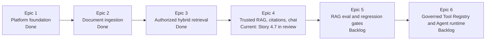
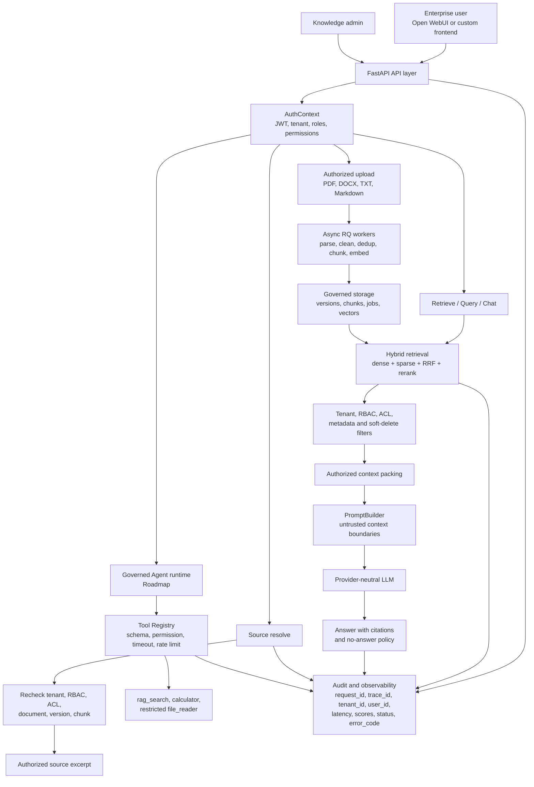

# AegisRAG

Production-grade private RAG with a governed Agent roadmap.

AegisRAG is a local-first enterprise knowledge system for teams that need more
than "upload a file and chat with it." It is built around secure retrieval,
traceable answers, tenant-aware access control, audit logs, provider-neutral
LLM orchestration, and a roadmap toward controlled tool-calling agents.

The goal is not to be another RAG demo. The goal is to show how a real private
knowledge application should be designed when the hard problems are
authorization, citations, ingestion reliability, observability, and operational
trust.

## Build Status

AegisRAG is still under active implementation. The current sprint status places
the project at **Epic 4.7: Open WebUI chat adapter, source detail, and lightweight
frontend contract**, which is in review.

That means the project is currently best understood as a trusted enterprise RAG
backend with chat, streaming, citations, source resolution, retrieval logs, and
Open WebUI-compatible integration work underway. The stronger eval hardening
and governed Agent runtime are still ahead.



This README describes both the implemented foundation and the product vision.
Planned Agent capabilities are explicitly called out as roadmap work rather
than completed runtime behavior.

## Product Vision

AegisRAG is intended to become the secure control plane for enterprise knowledge
AI: documents enter through governed ingestion, retrieval is filtered before the
model sees anything, answers are citation-grounded, and future tools run behind
auditable policy gates.



## Why AegisRAG Stands Out

Most RAG examples optimize for a quick answer. AegisRAG optimizes for answers
that can be governed, traced, and defended.

- Security-first retrieval: tenant, RBAC, ACL, metadata, soft-delete, and
  active-state filters are applied before retrieved chunks can reach the LLM.
- Auditable by design: retrieval, RAG generation, document lifecycle, source
  resolution, chat, and worker paths emit safe request, trace, user, tenant,
  latency, result, score, status, and error metadata.
- Citation-safe answers: citations are extracted only from the authorized
  packed context, never from model-written source claims.
- Hybrid retrieval foundation: dense retrieval, PostgreSQL full text sparse
  retrieval, RRF fusion, deduplication, thresholding, and rerank orchestration
  are separate testable components.
- Provider-neutral AI stack: LLM and embedding calls go through typed provider
  ports instead of hard-coded vendor SDKs.
- Local enterprise stack: FastAPI, PostgreSQL, Redis, MinIO, RQ workers,
  SQLAlchemy, Alembic, structlog, Pydantic v2, and pytest.
- Agent governance roadmap: agents are designed to run behind a Tool
  Registry with schema validation, permissions, timeouts, rate limits,
  max-step controls, and audit logging.

## Core Use Cases

- Internal policy, HR, legal, product, support, and engineering knowledge QA.
- Private document search with citations and version-aware source references.
- Secure multi-tenant RAG backends for Open WebUI or custom frontends.
- Retrieval quality debugging through safe retrieval logs and eval reports.
- Portfolio-grade demonstration of enterprise RAG, LLMOps, and AI backend
  engineering skills.

## Current Architecture

```text
apps/
  api/                 FastAPI routes and dependency assembly
  worker/              RQ ingestion and embedding workers
packages/
  auth/                request auth context, RBAC, ACL filter policy
  common/              config, errors, audit contracts, logging helpers
  data/                storage models, repositories, document metadata
  embeddings/          provider-neutral embedding ports and fake provider
  ingestion/           parsers, cleaners, dedup, chunking primitives
  llm/                 provider-neutral LLM DTOs, ports, fake provider
  memory/              chat sessions and bounded conversation memory
  rag/                 context packing, prompt building, generation, citations
  retrieval/           dense, sparse, hybrid, RRF, rerank, retrieval logs
  vectorstores/        vector store port and local/test adapters
tests/
  unit/                pure component and application service tests
  integration/         API and storage integration tests
  eval/                retrieval smoke evaluation fixtures and reports
```

The intended layering is:

```text
API Layer
  -> Application Service Layer
    -> Domain Layer
      -> Infrastructure Ports
        -> Storage / External Adapters
```

FastAPI routes stay thin. Business logic belongs in application services and
domain packages. LLMs, embeddings, vector stores, object storage, audit, and
chat memory are accessed through explicit boundaries.

## Security and Governance

AegisRAG treats user input, document text, retrieved context, client messages,
and tool output as untrusted.

Implemented security boundaries include:

- `AuthenticatedRequestContext` for protected business endpoints.
- JWT authentication with local development headers disabled by default.
- Tenant-scoped retrieval filters derived from backend auth context.
- RBAC permission checks for upload, retrieval, RAG query, chat, document
  status, soft delete, and source resolution paths.
- ACL filters applied at query time instead of after answer generation.
- Cross-tenant metadata widening rejected before retrievers are called.
- Source resolution rechecks tenant, RBAC, ACL, document, version, chunk,
  soft-delete, and active-state rules.
- Client `system`, `developer`, and `tool` messages in OpenAI-compatible chat
  are treated as untrusted conversation input, not backend policy.
- PromptBuilder wraps retrieved context as explicitly untrusted content and
  keeps backend security and citation policy outside client control.

Security-sensitive metadata is redacted from logs, audit events, queue payloads,
error responses, retrieval traces, prompt traces, and eval reports. The system
must not log API keys, bearer tokens, prompts, full document chunks, raw query
text, vectors, embeddings, provider raw responses, SQL text, cookies, local
absolute paths, or enterprise-sensitive content.

## Auditability and Observability

The project is built so a failed or suspicious answer can be investigated by
stage instead of treated as a black box.

Audit and observability paths currently cover:

- request ID and trace ID propagation
- tenant ID and user ID correlation
- structured request completion logs
- readiness probe logs for PostgreSQL, Redis, and MinIO
- document upload and ingestion job metadata
- embedding job status and safe vector count summaries
- retrieval logs with top-k, result count, highest rerank score, candidate IDs,
  RRF provenance, rerank provenance, latency, status, and error code
- RAG query audit events with context, prompt-risk, generation, citation,
  latency, and error summaries
- SSE stream event counts for token, citation, error, and final events
- source resolution audit events for allowed and denied source lookups

The logs are designed for operational debugging without leaking the content the
system is supposed to protect.

## Retrieval Pipeline

AegisRAG avoids the common demo pipeline:

```text
question -> vector top_k -> stuff chunks into prompt -> LLM
```

The production-oriented retrieval path is decomposed into testable steps:

```text
query
  -> dense retrieval
  -> sparse retrieval
  -> RRF merge
  -> deduplicate
  -> rerank
  -> threshold filter
  -> context packing
  -> prompt building
  -> generation
  -> citation extraction
```

Current retrieval components:

- `DenseRetriever` composes only `EmbeddingProvider` and `VectorStore` ports.
- `PostgresSparseRetriever` performs PostgreSQL full text sparse retrieval.
- `HybridRetriever` composes dense and sparse retrievers.
- `RRFMerger` fuses rankings and records safe fusion provenance.
- `RerankingRetriever` wraps an upstream retriever and an injected `Reranker`
  port.
- `FakeReranker`, fake embeddings, and fake vector stores provide deterministic
  local tests without external AI calls.

Every retrieval candidate carries citation and governance metadata such as
tenant ID, ACL, document ID, version ID, chunk ID, source, page range, score,
retrieval method, and safe metadata.

## RAG Generation

The RAG path is separated into retrieval, content hydration, context packing,
prompt building, provider-neutral generation, and citation extraction.

Key behaviors:

- Context packing rechecks tenant and ACL rules before prompt-ready context is
  built.
- Context packing enforces token budgets, deduplicates chunks, supports
  adjacent chunk merging, and records safe drop summaries.
- PromptBuilder creates structured message parts instead of one opaque prompt.
- Retrieved chunks are wrapped in explicit untrusted context boundaries.
- The LLM provider abstraction is the only generation boundary.
- CitationExtractor trusts only authorized packed context citation sources.
- No-answer responses return no citations.
- Unsupported generated source claims are represented as unsupported claims
  instead of being blindly accepted.

Available RAG endpoints:

```text
POST /query
POST /query/stream
POST /chat
POST /chat/stream
GET  /v1/models
POST /v1/chat/completions
POST /sources/resolve
```

`/query/stream` and `/chat/stream` emit named SSE events:

```text
citation
token
error
final
```

`tool_call` and `tool_result` are reserved for later governed Agent workflows.

## Document Ingestion

`POST /upload` accepts authorized multipart uploads for PDF, DOCX, TXT, and
Markdown files. Upload is asynchronous by design:

```text
upload
  -> object storage write
  -> document metadata
  -> document version metadata
  -> ingestion job
  -> parser worker
  -> clean / dedup / chunk
  -> embedding job
  -> vector store upsert
  -> retrieval_ready state
```

The upload API returns immediately after raw storage and job creation. It does
not block on parsing, chunking, embedding, or indexing.

Current ingestion support:

- Markdown parser
- TXT parser
- PDF parser with 1-based page metadata for text pages
- DOCX parser with heading hierarchy and intentionally empty page metadata
- pure cleaners
- exact section deduplication
- fixed-size chunking primitives
- chunk metadata persistence through tenant-scoped repository methods

OCR, table structure extraction, original document preview, and richer chunking
strategies remain later-stage work.

## API Surface

Health and readiness:

```text
GET /health
GET /ready
```

Document lifecycle:

```text
POST   /upload
GET    /documents/{document_id}/versions/{version_id}/status
DELETE /documents/{document_id}
DELETE /documents/{document_id}/versions/{version_id}
```

Retrieval and RAG:

```text
POST /retrieve
POST /query
POST /query/stream
POST /chat
POST /chat/stream
POST /sources/resolve
```

Open WebUI and OpenAI Chat Completions compatibility:

```text
GET  /v1/models
POST /v1/chat/completions
```

Non-streaming responses use a shared envelope:

```json
{
  "request_id": "req-123",
  "data": {},
  "error": null,
  "metadata": {
    "latency_ms": null
  }
}
```

Expected errors use stable structured codes and safe details. Unexpected errors
return `INTERNAL_ERROR` without raw exception details.

## Authentication

Business endpoints require `AuthenticatedRequestContext`.

JWT bearer tokens are verified with:

```text
JWT_SECRET
JWT_ALGORITHM
JWT_ISSUER
JWT_AUDIENCE
```

Supported token shape:

```json
{
  "sub": "user-123",
  "tenant_id": "tenant-abc",
  "roles": ["admin", "knowledge_manager"],
  "department": "HR",
  "permissions": ["document:read", "retrieval:query"],
  "exp": 1779854400
}
```

Local development headers are disabled by default and are accepted only when
the app runs in a local/test environment and `ENABLE_DEV_AUTH_HEADERS=true`:

```text
X-Request-ID: req-local-1
X-Trace-ID: trace-local-1
X-Session-ID: session-local-1
X-User-ID: user-123
X-Tenant-ID: tenant-abc
X-Roles: admin,knowledge_manager
X-Department: HR
X-Permissions: document:read,retrieval:query
```

## Storage Model

Current Alembic migrations create the foundational tables:

```text
tenants
users
roles
user_roles
audit_logs
documents
document_versions
ingestion_jobs
chunks
embedding_jobs
vector_records
retrieval_logs
chat_sessions
chat_messages
```

All tables include `id`, `created_at`, and `updated_at`. Governance-sensitive
tables also carry tenant, user, status, request, trace, and safe metadata fields.

SQLAlchemy models are storage details. Application and domain packages consume
typed DTOs and async repositories instead of passing ORM models across layers.

## Local Development

Install dependencies and run the core checks:

```powershell
uv sync
uv run pytest
uv run ruff check .
uv run mypy apps packages tests
```

Database schema is managed by Alembic:

```powershell
$env:DATABASE_URL = "postgresql+asyncpg://<db_user>:<db_password>@<db_host>:<db_port>/<db_name>"
uv run alembic upgrade head
```

`DATABASE_URL` is loaded through `packages.common.config` and must stay in
environment variables or local config. Do not commit real database hosts,
accounts, passwords, local absolute paths, or provider secrets.

## Docker Compose

Copy `.env.example` to `.env` and replace local placeholder secrets. Never
commit `.env`.

Validate the Compose configuration:

```powershell
docker compose -f docker/compose.yaml config
```

Start the local dependency stack, migration, API, and workers:

```powershell
docker compose -f docker/compose.yaml up -d --build postgres redis minio migration api worker-ingestion worker-embedding
```

Stop the stack:

```powershell
docker compose -f docker/compose.yaml down
```

Remove local volumes only when intentionally resetting local state:

```powershell
docker compose -f docker/compose.yaml down -v
```

The worker services use separate RQ queues:

```text
worker-ingestion -> WORKER_QUEUE_NAME=ingestion
worker-embedding -> WORKER_QUEUE_NAME=embedding
```

Queue payloads must be JSON-serializable ID and summary DTOs only. Do not
enqueue file objects, ORM models, auth contexts, full document text, prompts,
tokens, API keys, or local absolute paths.

## Evaluation and Tests

Retrieval eval smoke fixtures live under `tests/eval`.

Run the default smoke dataset:

```powershell
.venv\Scripts\python.exe -m tests.eval.retrieval.run_smoke --dataset tests/eval/datasets/retrieval_smoke.json --report-dir tests/eval/reports
```

The report records summary metrics and per-case IDs only:

```text
case_count
passed_count
failed_count
retrieval_hit_rate
acl_isolation_passed
no_answer_passed
prompt_injection_passed
average_latency_ms
matched document IDs
matched chunk IDs
request and trace IDs
tenant and user IDs
```

It does not store query text, chunk content, SQL, vectors, embeddings, provider
raw responses, secrets, tokens, or local absolute paths.

Useful focused test commands:

```powershell
.venv\Scripts\python.exe -m pytest tests/unit/rag/test_context_packer.py
.venv\Scripts\python.exe -m pytest tests/unit/rag/test_prompt_builder.py
.venv\Scripts\python.exe -m pytest tests/unit/llm tests/unit/rag/test_generation.py
.venv\Scripts\python.exe -m pytest tests/unit/rag/test_citation_extractor.py tests/unit/rag/test_query_service.py tests/unit/rag/test_streaming.py
.venv\Scripts\python.exe -m pytest tests/integration/api/test_query_routes.py
.venv\Scripts\python.exe -m pytest tests/unit/memory tests/integration/api/test_chat_routes.py tests/integration/storage/test_chat_memory_repositories.py
```

The default local/test providers are deterministic fakes and do not call real
OpenAI, Qwen, DeepSeek, vLLM, Ollama, pgvector, OpenSearch, Redis, MinIO, or
network services unless explicitly configured by the tested path.

## Current Limits

The following are intentionally not included yet:

- real OpenAI, Qwen, DeepSeek, vLLM, and Ollama provider adapters
- Open WebUI function/tool bridge
- `/v1/embeddings`
- image and audio endpoints
- full custom React or Next.js admin console
- document previewer
- full Agent runtime and tool event streaming
- conversation summarization through an LLM
- citation eval and RAG answer eval
- CI smoke gates
- OCR and table-aware parsing
- Milvus, Graph RAG, multi-agent workflows, and complex web crawling

These are later-stage capabilities. The MVP priority is trusted enterprise RAG:
ingestion, tenant-safe retrieval, citations, source resolution, audit logs,
Open WebUI compatibility, eval fixtures, and local deployment.

## Design Principles

- Do not put business logic in FastAPI routes.
- Do not let prompts or LLMs decide authorization.
- Do not retrieve cross-tenant or unauthorized chunks.
- Do not send untrusted document text to the model without explicit boundaries.
- Do not log secrets, prompts, full document text, raw queries, vectors, or
  provider payloads.
- Do not bind application logic to a single LLM, embedding, or vector provider.
- Do not make document upload wait for large parsing, embedding, or indexing
  jobs.
- Do keep every critical stage observable, testable, and replaceable.

## Project Positioning

AegisRAG is for engineers who want to demonstrate or build the parts of RAG
that matter in real enterprise environments:

- private deployment
- tenant isolation
- RBAC and ACL enforcement
- hybrid retrieval
- citation-grounded generation
- source-level traceability
- async ingestion and embedding
- provider abstraction
- safe audit trails
- controlled Agent foundations

If a normal RAG demo answers "can it chat with my PDF?", AegisRAG answers the
harder production question: "can we trust, audit, secure, and operate it?"
