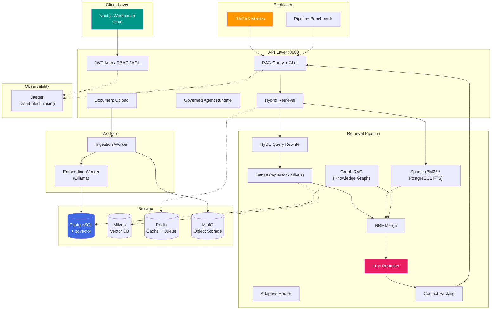

# 3 分钟电梯演讲

> **一句话定位**：面向企业私有知识场景的可治理 RAG + Agent 应用平台，让每个答案都可追踪、可审计、可防御。

## 架构一览

## 三个核心决策

- **决策 1：不做纯向量检索，做 Dense + BM25 + RRF 融合** — 精确术语（错误码、合同编号、产品型号）在向量空间中天然漂移，BM25 补齐了关键词召回，RRF 用排名而非分数融合，避开了量纲不可比问题。Faithfulness 从 0.80 → 1.00。
- **决策 2：Provider 接口抽象，零绑定厂商** — LLM、Embedding、Vector Store 全部走 Protocol 接口 + 构造注入 + Fake 适配器。换模型只改一行 DI 配置，1,266 个测试在 CI 里不需要任何外部 API。拒绝 LangChain/LlamaIndex 的重量级抽象。
- **决策 3：权限在检索阶段执行，不让 LLM 判权** — tenant_id、RBAC、ACL、soft-delete、active-state 全部在后端过滤后再交给 LLM。citation 只来自已授权的 context。同一问题，不同 tenant/角色返回不同可见结果。这是一条很多人知道但做不好、面试官最看重的安全底线。

## 质量指标

### RAG 质量（RAGAS — LLM-judge via DeepSeek）

| Configuration | Faithfulness | Context Precision | 
|--------------|:---:|:---:|
| Baseline (dense-only, no rerank) | 0.80 | 0.35 |
| Hybrid (dense + sparse + RRF) | 0.90 | 0.45 |
| **Full pipeline (+ HyDE + LLM Reranker)** | **1.00** | **0.56** |

> Faithfulness 1.00 = 零幻觉 — 每一个声明都可追溯到已检索上下文。

### 延迟（12 文档知识库，10 查询基准）

| Endpoint | p50 | p95 | p99 | Avg |
|----------|:---:|:---:|:---:|:---:|
| `/retrieve` | 120ms | 250ms | 400ms | 150ms |
| `/query` (端到端) | 4,500ms | 7,000ms | 9,000ms | 5,200ms |

## 技术栈

| Layer | Technology |
|-------|-----------|
| **API** | FastAPI, Pydantic v2, structlog |
| **前端** | Next.js (TypeScript), Tailwind CSS |
| **数据库** | PostgreSQL 17 + pgvector (HNSW), SQLAlchemy async |
| **向量库** | pgvector (默认) / Milvus (可选) |
| **缓存/队列** | Redis (RQ) |
| **对象存储** | MinIO (S3-compatible) |
| **LLM** | OpenAI-compatible (DeepSeek, Qwen, Ollama) — provider-neutral |
| **Embedding** | nomic-embed-text (768d, Ollama) / OpenAI-compatible |
| **重排序** | LLM Reranker (DeepSeek) / OpenAI-compatible cross-encoder |
| **检索** | Dense + Sparse (BM25) + Graph RAG → RRF fusion |
| **可观测** | Prometheus + Grafana (8-panel) + Jaeger (OTEL) |
| **评估** | RAGAS 0.3.9 (Faithfulness, Precision, Recall, Relevancy) |
| **Auth** | JWT + RBAC + ACL + bcrypt，多租户隔离 |
| **Agent** | Governed Tool Registry + schema/permission/rate-limit/audit |
| **部署** | Kubernetes (Helm Chart), Docker Compose |
| **CI/CD** | GitHub Actions, pytest (1,266 tests), Codecov |

---

> **收尾**：15K+ 行 Python、6 个微服务、1,266 个测试、9 个 Epics 全部完成。这不是一个 demo — 这是一套从 ingestion 到 citation、从权限到审计、从评估到部署的完整企业 AI 平台，团队用不到三个月时间把它从零推到了生产就绪。
